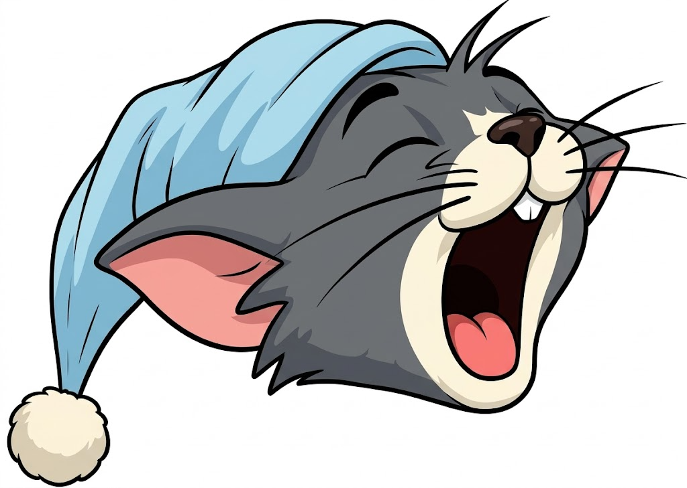

<div align="center">


<h2><a href="https://arxiv.org/abs/2605.30010">EarlyTom: Early Token Compression Completes Fast Video Understanding</a></h2>

[Hesong Wang](https://viridisgreen.github.io/)<sup>1,2,3,🌟</sup>, [Xin Jin](https://jinxins.github.io/)<sup>2,🌟</sup>, Lu Lu<sup>3,✉️</sup>, Chenhaowen Li<sup>3</sup>, Jian Chen<sup>3</sup>, Qiang Liu<sup>3</sup>, [Huan Wang](https://huanwang.tech/)<sup>2,✉️</sup>

<sup>1</sup>Zhejiang University, <sup>2</sup>Westlake University, <sup>3</sup>Alibaba Cloud Computing

<sup>🌟</sup> Equal Contribution <sup>✉️</sup> Corresponding Author
</div>

<p align="center">
    <a href="https://viridisgreen.github.io/EarlyTom/" alt="arXiv">
        </a>
    <a href="https://viridisgreen.github.io/EarlyTom/" alt="Webpage"></a>
</p>


## 📆 News

**[2026/5/28]** We release the EarlyTom code.


## 🔍 Introduction

**EarlyTom** is a training-free token compression method for video large language models (Video-LLMs). It reduces the number of visual tokens by leveraging early-layer attention signals to identify and prune redundant tokens before they propagate through the full model, significantly reducing computation while preserving performance.

EarlyTom supports two complementary compression strategies:

- **Outer compression**: Prunes redundant visual tokens at the vision encoder output, guided by attention weights from early transformer layers.
- **Inner compression** (optional): Further merges tokens inside the LLM backbone at specified layers using a DPC-KNN clustering approach.


## 🛠 Installation

### 1️⃣ Clone the repository

```shell
git clone https://github.com/viridisGreen/EarlyTom
cd EarlyTom
```

### 2️⃣ Install dependencies

EarlyTom is built on top of [LLaVA-NeXT](https://github.com/LLaVA-VL/LLaVA-NeXT). Set up the environment following LLaVA-NeXT's instructions first:

```shell
conda create -n earlytom python=3.10 -y
conda activate earlytom
pip install --upgrade pip
cd LLaVA-NeXT
pip install -e .
pip install -e ".[train]"
pip install flash-attn --no-build-isolation
cd ..
```

### 3️⃣ Install EarlyTom

```shell
pip install -e .
```

### Install from requirements

```shell
pip install -r requirements.txt
```


## 🚀 Quick Start

EarlyTom wraps any LLaVA-OneVision model with a single function call:

```python
import os
from llava.model.builder import load_pretrained_model
from llava.mm_utils import get_model_name_from_path
from earlytom import earlytom

pretrained = "path/to/llava-onevision-qwen2-7b-ov"
model_name = "llava_qwen"
tokenizer, model, image_processor, max_length = load_pretrained_model(
    pretrained, None, model_name, device_map="auto", attn_implementation="sdpa",
    multimodal=True
)

# Apply EarlyTom compression
model = earlytom(model)
model.eval()
```


## 📊 Evaluation

We use [lmms-eval](https://github.com/EvolvingLMMs-Lab/lmms-eval) for evaluation. Scripts are provided under `scripts/`.

### LLaVA-OneVision-7B

```shell
bash scripts/ov/eval_ov-7b_earlytom.sh
```

Example configuration for VideoMME at retain ratio 0.2:

```shell
export WRAPPER=earlytom
export RETAIN_RATIO=0.20
export T=0.5
export M=6
export INNER_k=18
export INNER_r=0.5
export PRUNE_LAYERS="8,21,23"

CUDA_VISIBLE_DEVICES=0,1,2,3,4,5,6,7 \
accelerate launch --num_processes=8 --main_process_port=25000 \
-m lmms_eval \
--model llava_onevision \
--model_args pretrained=path/to/model,conv_template=qwen_1_5,model_name=llava_qwen,max_frames_num=32 \
--tasks videomme \
--batch_size 1 \
--output_path ./logs/ov-7b-earlytom/videomme/0.20
```

Supported benchmarks: `mvbench`, `videomme`, `egoschema`, `longvideobench_val_v`.


## ❤ Acknowledgement

This work is built upon [LLaVA-NeXT](https://github.com/LLaVA-VL/LLaVA-NeXT), [HoliTom](https://github.com/cokeshao/HoliTom). We thank them for their excellent open-source contributions.

---

## 🤗 Citation

If EarlyTom is useful for your research, please consider citing:

```bibtex
@inproceedings{
    wang2025earlytom,
    title = {EarlyTom: Early Token Compression Completes Fast Video Understanding},
    author = {Wang, Hesong and Jin, Xin and Lu, Lu and Chenhaowen Li, Jian Chen and Qiang Liu and Wang, Huan},
    year = {2026},
    booktitle={CVPR},
}
```
